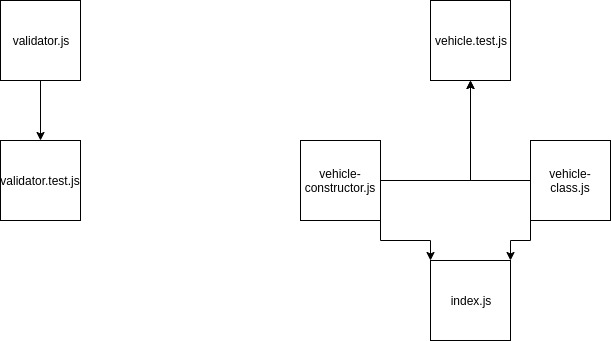

# LAB - 02

## Classes, Inheritance, Functional Programming

### Author: Travis Skyles

### Links and Resources

- [submission PR](https://github.com/tskyles-401-advanced-javascript/401-lab-02/pull/2)
- [travis](https://travis-ci.com/tskyles-401-advanced-javascript/401-lab-02)

#### Documentation

- `jsdocs` live-server from `/docs` directory

### Modules

validator.js
vehicle-class.js
vehicle-constructor.js

#### How to initialize/run your server app (where applicable)
- clone repository
- npm start

#### Tests

eslint - npm run lint
tests - npm test

#### UML

